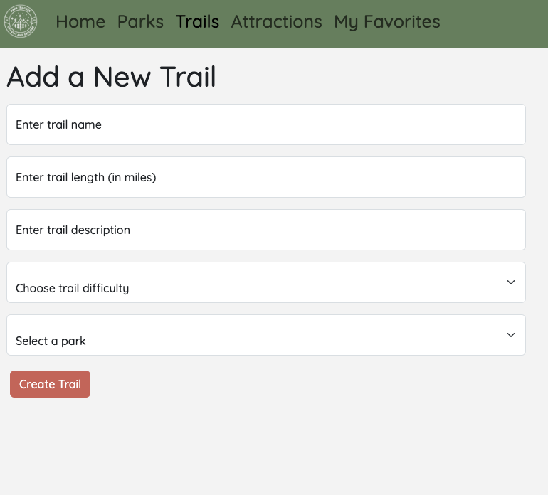

# ParkTracker
This is the client side repo to the ParkTracker application. ParkTracker serves as a space to organize your past and future trips to National or State Parks by adding trails and sites you've seen along the way. This project came about when a few different friends asked me for recommendations on where to go in National Parks and I could not remember which trails I had hiked or sites I had seen. With ParkTracker, I can make a list that will organize all of this for future recommendations.

## About the User
- Ideal user for the application is anyone who is wanting to organize information for past or future trips to parks.
- The user wants to create parks they have visited and add details about trails and sites while they were there.
- The user wants look at parks created by others to get ideas of what they can do while visiting.
- The user wants to favorite parks to keep lists of ideas they would like to return to.
  
## Features
- Parks, Sites, and Trails can be added to each page via a form. These can be updated and deleted as well.
- Users can only update and delete their own items. They can view all items.
- Users can favorite parks.

## Relevant Links
- ERD [https://dbdiagram.io/d/64dab8d502bd1c4a5ec59e72]
- Wireframe [https://www.figma.com/file/bNxkskrtgIgppSiWLXCgTu/Park-Tracker?type=design&node-id=0-1&mode=design&t=n3vmWdCc2NIJ41O7-0]
- Project Board [https://github.com/users/erin-stephens/projects/8/views/1?layout=board]

## Code Snippet
```
export default function ParkForm({ obj }) {
  const [currentPark, setCurrentPark] = useState(initialState);
  const router = useRouter();
  const { user } = useAuth();

  useEffect(() => {
    if (obj.id) {
      setCurrentPark({
        id: obj.id,
        parkName: obj.park_name,
        imageUrl: obj.image_url,
        location: obj.location,
        parkType: obj.park_type,
      });
    }
  }, [obj, user]);

  const handleChange = (e) => {
    const { name, value } = e.target;
    setCurrentPark((prevState) => ({
      ...prevState,
      [name]: value,
    }));
  };

  const handleSubmit = (e) => {
    e.preventDefault();
    if (obj.id) {
      const parkUpdate = {
        id: obj.id,
        parkName: currentPark.parkName,
        imageUrl: currentPark.imageUrl,
        location: currentPark.location,
        parkType: currentPark.parkType,
        userId: user.uid,
      };
      updatePark(parkUpdate).then(() => router.push('/parks'));
    } else {
      const park = {
        parkName: currentPark.parkName,
        imageUrl: currentPark.imageUrl,
        location: currentPark.location,
        parkType: currentPark.parkType,
        userId: user.uid,
      };
      createPark(park).then(() => router.push('/parks'));
    }
  };
```
## Project Screenshots
      
## Contributors
- [Erin Stephens](https://github.com/erin-stephens)
